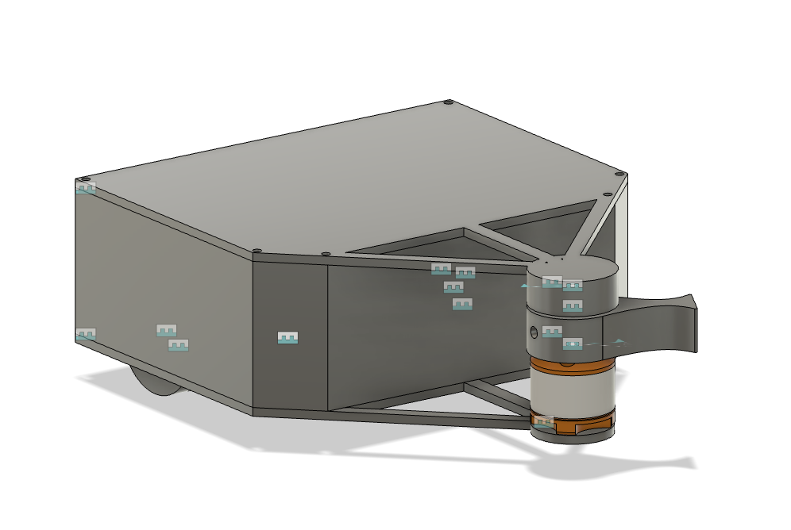
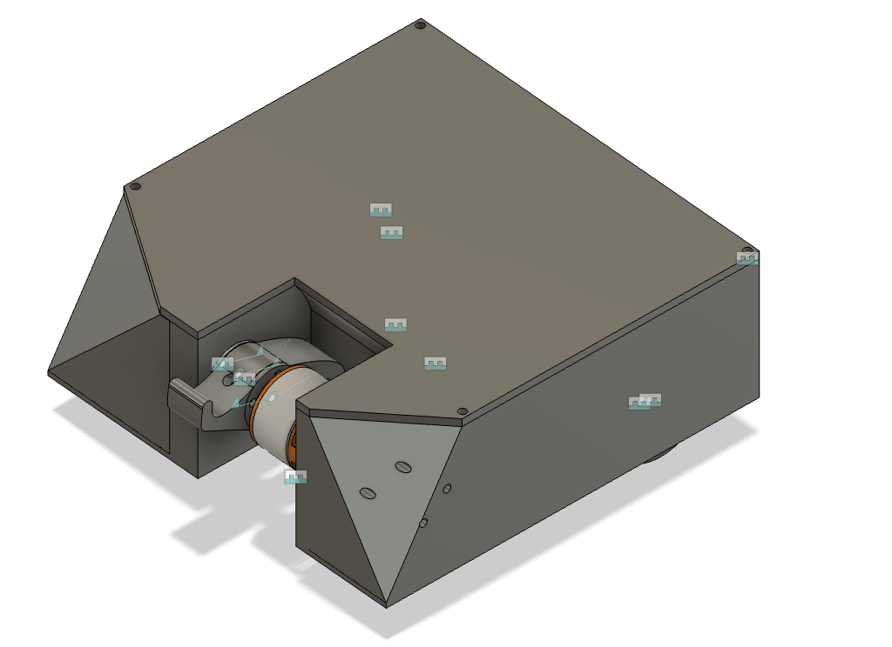

Time Spent: 14 hours

## May 15, 2025

Highway was announced and it's a great time to make a project that I've always wanted. 2 BattleBots to break each other. The big challenge for this project is to make sure they both work in order to do damage.

I started by watching a lot of BattleBots and trying to find different designs from different weight classes. I then drew a couple designs that I liked.

Time Spent: Around 1 hour

## May 16, 2025

Now that I had the idea, I wanted to determine how to build it. I first decided what main components I need to make this idea possible. Each robot needs to be controlled (user feedback), drive, and spin up a weapon system. Once I had an idea of the requirements, I made some high level diagrams to figure how to wire the robots. I also made a power distrubution diagram. This part is quite expensive because different components requires different voltages. In my past experiences, power is the hardest for the projects. This time, I want to wire as neatly as possible. I then broke the BOM into two main sections. Electoronics and Mechanical. After I listed everything I classified them into things I already have and things that I needed to buy. Afterwards, I went on amazon (cheapest and fastest place to get electronics for me) to find the items that I'm missing. I spent a lot of time trying to optimize the budget and keep the cost low. The current buy items are in [BOM.csv](./BOM.csv). 

Time Spent: 3 hours

## May 17, 2025

Today I spent a lot of time cading out the design. I first started by 150 mm x 150 mm square and placed each component inside where I think would best fit. After I was happy with it I moved on making it 3D. I worked on the front where I had to learn how to create planes at angles to create the angled ramps at the front of the robot. I also caded up the weapon assembly for bot 1. For bot 2, I took similar layout from bot 1 and changed where the weapon is and its support.

Time Spent: 2.5 hours

## May 18, 2025

Once I had both chasis done, I decided to try and fit the components in the chassis. I followed my original layout and it worked pretty well. I also made the weapon assembly for bot 2. Most of the cad is done for bot 2. For bot 1 I added all the components but as I was adding a top I realized I made the chassis too short so I increased. However, this changed all my other values and so it looks like a mess right now. I’ll fix that for tomorrow and create a schematic.

Time Spent: 3 hours

## May 19, 2025

I fixed up the bot 1 which took a while. I had to go back in the timeline and change a lot of parameters and remake the sketches.

Time Spent: 1 hour

## May 20, 2025

I made the schematic for the robot. I had to search a lot of the pinouts and I also finally figured out the motor controller for the drive wheels. I’ll be using the L293D which I already have. I also wrote some of the firmware for the pi and the arduino controller. I learned that it’s not a good idea to have the cg of the weapon away from the point of rotation. As a results, I remade it to change the cg position.

Time Spent: 1.5 hour

## May 22, 2025

I made sure that my cad was correct with the right dimensions. I added some threads to the weapon system. I contacted places to get quotes for the cnc parts. I also got the general code done. I used previous code from before which had the transceiver.

Time Spent: 1.5 hour 

## Jun 8, 2025

I got past the obstacle which was trying to lower the price. I removed some unneecessary parts. I'm still over, but I will pay it out of pocket. I also worked on schematic for the controller and that should be it.

Time Spent: 0.5 hour

## Jul 20, 2025

Received all the parts and started 3D printing the components. I began printing the body out of TPU. While that was printing, I soldered wires to the motors and attached the motor controllers to a protoboard with headers for easier connections.

Time Spent: 1.5 hours

## Jul 21, 2025

I soldered more wires to the voltage converters and connected the power distribution protoboard with terminal blocks. I also adjusted the voltage outputs of each converter using a multimeter. I continued printing more parts.

Time Spent: 1.5 hour

## July 22, 2025

I connected the whole circuit and attempted to get things moving. I used SSH to access the Raspberry Pi and was able to write a quick test script to run the motors, including the brushless motor. Setting up the Raspberry Pi took a while. I used SSH along with VSCode’s SSH extension.

Time Spent: 2 hours

## July 23, 2025

I tried to make the same circuit for the other bot and setup the pi but this time the brushless motor would not turn. It would only beep faster. I then tried the motor which beeped the same. I then swapped the Electronic Speed Controller and then it spun. The previous ESC did not work so I had to buy a new one. I also finished printing all the 3D parts.

Time Spent: 2 hours

## July 26, 2025

I had to wait for the new ESC to come but when it came, the ESC was a bit different. The startup was worse, so when throttle or signal was sent it wouldn't spin right away. I had to calibrate and test it multiple times. Once I got that working, I made sure the rest of the motors worked.

Time Spent: 2 hours

## July 27, 2025

I tried hot gluing the dc motors to the chasis but it wasn't sticking. I tried sanding but nothing worked. In the end, I used super glue which worked really well. I also assembled the weapon system which looked terrifying. Once it was done, I squeezed everything into the chassis. I was worried about the wires getting caught on the wheel, but that wasn't a problem when testing. I also used hot glue to make sure that the wires would not be loose. It works pretty well.

Time Spent: 1.5 hours

## July 28, 2025

I did the same thing to the other bot but ran into an issue. My cad was wrong for the cnc part and I wasn't able to reach the bolt to tighten it to the motor. I had to use a drill and drill to the side. It took a really long time. But in the end, it worked. I got it all built and tested and the bots are terrifying even though they are only running at half speed.

Time Spent: 4 hours