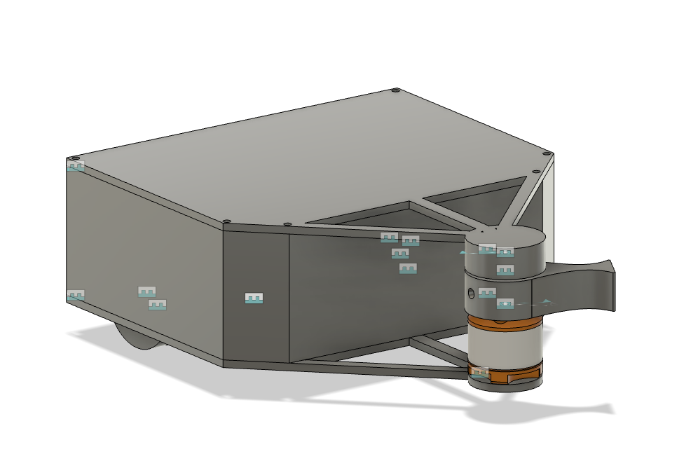
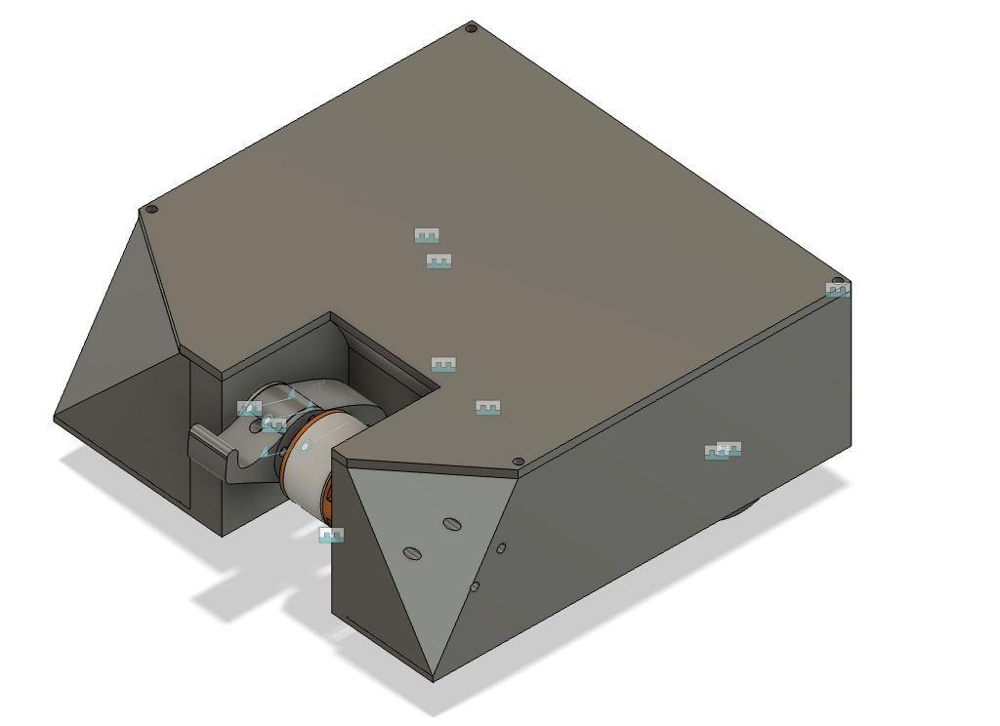
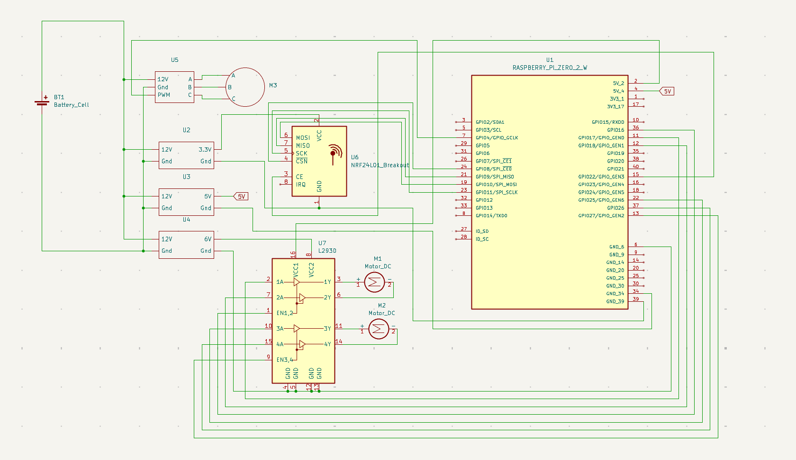

# BattleBots

**Description:

** This project contains two battle bots that are meant to battle each other. One has a vertical spinner while the other has a horizontal one. The chassis is mostly 3D printed with some electronics for the drive base. Both bots are powered by Raspberry Pi Zero 2 W boards, each running a local server. Users connected to the same Wi-Fi network can control the bots through a web interface using arrow keys for movement and the space bar to activate the weapon.

**Motivation for this project:** I made this project because I’ve watched the larger bots and it was fun to see stuff being destroyed.



ROBOT 1: Full CAD https://a360.co/3ZUvcW5


ROBOT 2: Full CAD https://a360.co/43yXR5A

## Pictures:



Wiring Diagram:


## BOM:

Purchase Item:

| Item Name | What the Item Is For in Your Project | Item Source | Item Price (USD) | Quantity | Total Price (USD) | URL |
|-----------|---------------------------------------|-------------|------------------|----------|--------------------|-----|
| DC 6V Motor with gear | Used for drive motors for the robot | Amazon | 6.71 | 1 | 6.71 | [Link](https://www.aliexpress.com/item/1005005847467025.html?spm=a2g0o.detail.pcDetailTopMoreOtherSeller.1.3dcfHJvKHJvKyd&gps-id=pcDetailTopMoreOtherSeller...) |
| CNHL 3S Lipo Battery 2200mAh 30C 11.1V (2 Packs) | Used to power Robots | Amazon | 34.72 | 1 | 34.72 | [Link](https://www.amazon.ca/CNHL-Battery-Airplane-Helicopter-Quadcopte/dp/B0B6N7BTVN/) |
| RC B3 LiPo 2S-3S Battery Charger | Used to charge lipo battery | Amazon | 12.11 | 1 | 12.11 | [Link](https://www.amazon.ca/Battery-Balancer-Charger-7-4-11-1V-Compact/dp/B06XR87987/) |
| 10pcs DC to DC Buck Converter Modules | Step down to different voltages | Amazon | 14.53 | 1 | 14.53 | [Link](https://www.amazon.ca/Podazz-Efficiency-Regulator-stabilization-Converter/dp/B0CTH5Q2KT/) |
| Wago Connectors | Connect wires, reduce mess | Amazon | 7.59 | 1 | 7.59 | [Link](https://www.amazon.ca/WAGO-221-412-Lever-Nuts-2-Conductor-Connectors/dp/B07W4RQ6R6/) |
| Terminal Connectors | Power distributions on protoboard | Aliexpress | 3.56 | 1 | 3.56 | [Link](https://www.aliexpress.com/item/1005006642865467.html) |
| Protoboard (2-8) | Power distributions | Aliexpress | 1.77 | 1 | 1.77 | [Link](https://www.aliexpress.com/item/1005006829112244.html) |
| CNC for weapon | BattleBot Weapon | JLCPCB | 83.50 | 1 | 83.50 | - |
| **Total** | | | | | **164.49** | |

Already Have

| Item | What the Item Is For in Your Project | Quantity |
|------|--------------------------------------|----------|
| Pi Zero | Microcontroller | 2 |
| Brushless Motor | Motor | 2 |
| NRF24L01 | Transceiver | 4 |
| ESC | ESC for motor | 2 |
| Arduino Uno | Microcontroller | 2 |
| Joystick | Joystick | 4 |
| Push Button | Button | 2 |
| Bearings | For weapon system | 2 |

